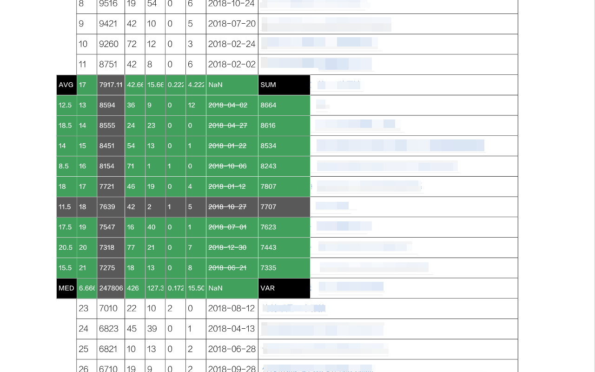
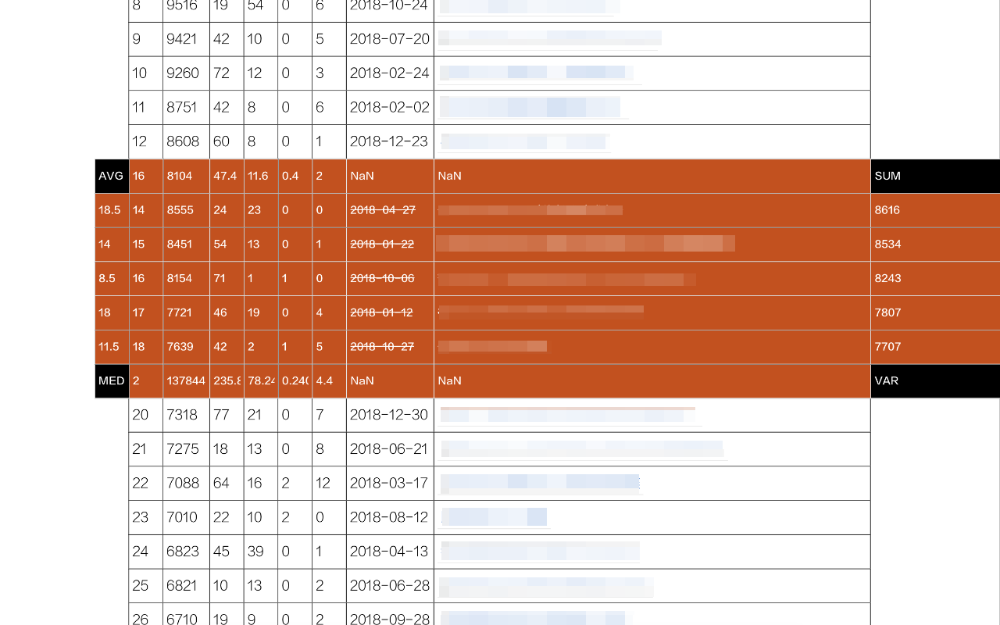

HiTable: Instant Table Analysis
===

> Your on-the-go data analysis tool.

This extension calculates statistics for table rows and columns instantly and in-place.

Simplify your workflow with HiTable - your on-the-go data analysis tool.
HiTable is a powerful Chrome extension designed to simplify your data analysis tasks. It allows you to perform instant, in-place calculations on HTML tables directly within your browser. No more copying and pasting tables into Excel or other tools for basic computations. With HiTable, you can easily calculate sums, averages, counts, and variances for rows and columns. It's perfect for quick data analysis, auditing data, or just exploring numbers on web pages. 

### How to Use

First, after installing this extension, you need to pin it to the browser's toolbar. By default, this extension is not activated, and the icon in the toolbar is displayed in gray. When you need to use this extension for table data calculation, click the icon in the toolbar to activate the extension, at which point the icon will be displayed as an icon with a green frame.

Once activated, you can select a rectangular area in the table by pressing the left mouse button and dragging. Release the mouse to end the selection, at which point a floating layer will pop up outside the selected area, which will perform various statistics on the rows and columns of the selected area on four sides. The clockwise left side of these four sides shows the statistical algorithm being used on each side.

You can cancel the selection by clicking on a cell outside the selected area or pressing the `Esc` key. When the `Shift` key is pressed, dragging the selection in the first row or first column will select multiple entire columns or rows; if you click on the top left cell of the table (i.e., the first cell of the first row) while pressing the `Shift` key, the entire table will be selected.

Clicking on the four corners of the floating layer can switch between multiple statistical algorithms. Pressing `CTRL-C` (or `Meta-C` on a Mac) can copy the selected area, and the copied content can be pasted into tools like Excel, Numbers, etc. for more complex processing. If you press `CTRL-C` (or `Meta-C` on a Mac) twice in quick succession, you can copy all the data including the floating layer and the selected area.

For non-numeric cells, a strikethrough will be marked on them during selection, and the cell will be skipped during calculation. When moving the mouse within the selected area, a cross line will be highlighted to clearly find the statistical results corresponding to that row or column.

Right-click on the extension icon, and you can select "Config" in the right-click menu, which will open the configuration page. On this page, you can configure the border color of the extension, the default statistical algorithm for the four sides, etc.

