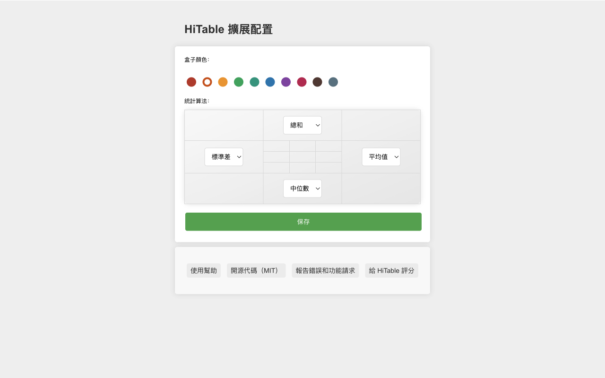

HiTable：直接分析網頁表格數據
===

> 無需離開網頁、無需複製數據、無需開啟 Excel，即可在網頁的表格上進行各種統計分析。

這個擴充功能可以即時同埋原地計算表格行同列嘅統計數據。

HiTable 係一個功能強大嘅瀏覽器擴充功能，目的係簡化您嘅數據分析任務。佢可以讓您直接喺瀏覽器中對 HTML 表格進行即時嘅、原地嘅計算。唔再需要將表格複製貼上到 Excel 或者其他工具中進行基本計算。使用 HiTable，您可以輕鬆計算行同列嘅總和、平均值、計數同方差等。佢非常適合快速數據分析、數據審計或者只係喺網頁上探索數字。

### 使用方法

首先，安裝呢個擴充功能之後，你需要將佢固定喺瀏覽器嘅工具列上。預設情況下，呢個擴充功能係未啟動嘅，工具列中嘅圖示顯示為灰色。當你需要使用呢個擴充功能進行表格數據計算嘅時候，點擊工具列中嘅圖示以啟動擴充功能，呢個時候圖示將顯示為帶綠色框嘅圖示。

請開啟一個包含數據表的頁面，例如：
https://en.wikipedia.org/wiki/Economy_of_the_United_States#Data

一旦啟動，你可以透過按低滑鼠左鍵並拖曳喺表格中選擇一個矩形區域。放開滑鼠以結束選擇，呢個時候將喺選擇區域外彈出一個浮層，呢個浮層喺四個邊上分別對選擇區嘅行同列進行各種統計。呢四個邊嘅順時針左側顯示咗各個邊正在使用嘅統計算法。

你可以透過點擊選擇區域外嘅單元格或者按低 `Esc` 鍵來取消選擇。當按低 `Shift` 鍵嘅時候，在第一行或者第一列拖曳選擇將選擇多個整列或者整行；如果喺按低 `Shift` 鍵嘅同時點擊表格嘅左上角單元格（即第一行嘅第一個單元格），將選擇整個表格。

點擊浮層嘅四個角可以喺多種統計算法中切換。按低 `CTRL-C`（喺 Mac 上係 `Meta-C`）可以複製選擇區域，複製嘅內容可以貼上到 Excel、Numbers 等工具中以進行更複雜嘅處理。如果快速連續按低兩次 `CTRL-C`（喺 Mac 上係 `Meta-C`），咁就可以複製包括浮層同選擇區域嘅全部數據。

對於非數字單元格，在選擇嘅時候會喺佢上面標記刪除線，並喺計算嘅時候跳過該單元格。喺選擇區域內移動滑鼠嘅時候，會高亮顯示一個十字線，以便明確找到該行或者列對應嘅統計結果。

右鍵點擊擴充功能圖示，可以喺右鍵選單中選擇“配置”，呢個將打開配置頁面。喺呢個頁面，你可以配置擴充功能嘅邊框顏色、四個邊嘅預設統計算法等。

### 錯誤報告和功能建議

如果你在使用過程中遇到任何問題（例如，有的表格不能正確選擇或顯示統計層），或者有任何功能建議，請在 [GitHub](https://github.com/wxy/HiTable/issues) 上提交議題。

### 隱私政策

HiTable 不會收集任何用戶數據。所有數據都是在用戶的電腦上進行處理的。

HiTable 是開源軟件，遵循 MIT 許可證。你可以在 [GitHub](https://github.com/wxy/HiTable) 上查看源代碼。