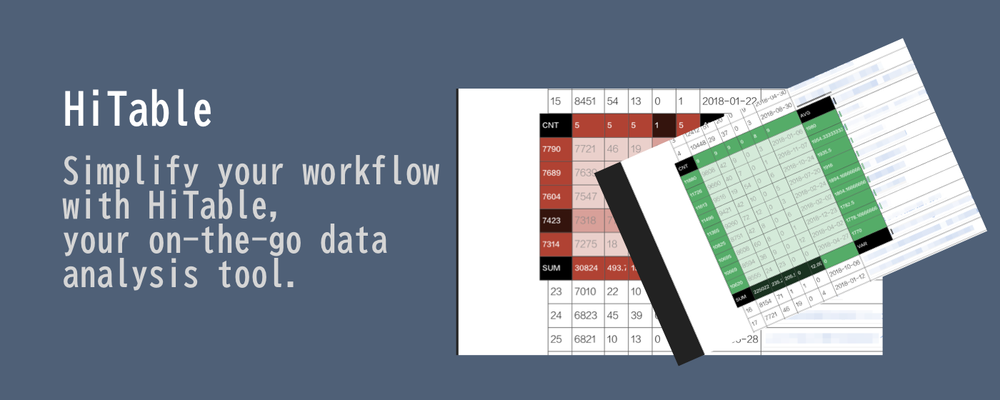

使用 HiTable 简化网页数据分析
===

> 您的随时随地的数据分析工具。

该扩展可以即时且原地计算表格行和列的统计数据。

HiTable 是一个功能强大的 Chrome 扩展，旨在简化您的数据分析任务。它允许您在浏览器中直接对 HTML 表格进行即时的、原地的计算。不再需要将表格复制粘贴到 Excel 或其他工具中进行基本计算。使用 HiTable，您可以轻松计算行和列的总和、平均值、计数和方差等。它非常适合快速数据分析、数据审计或仅仅是在网页上探索数字。

