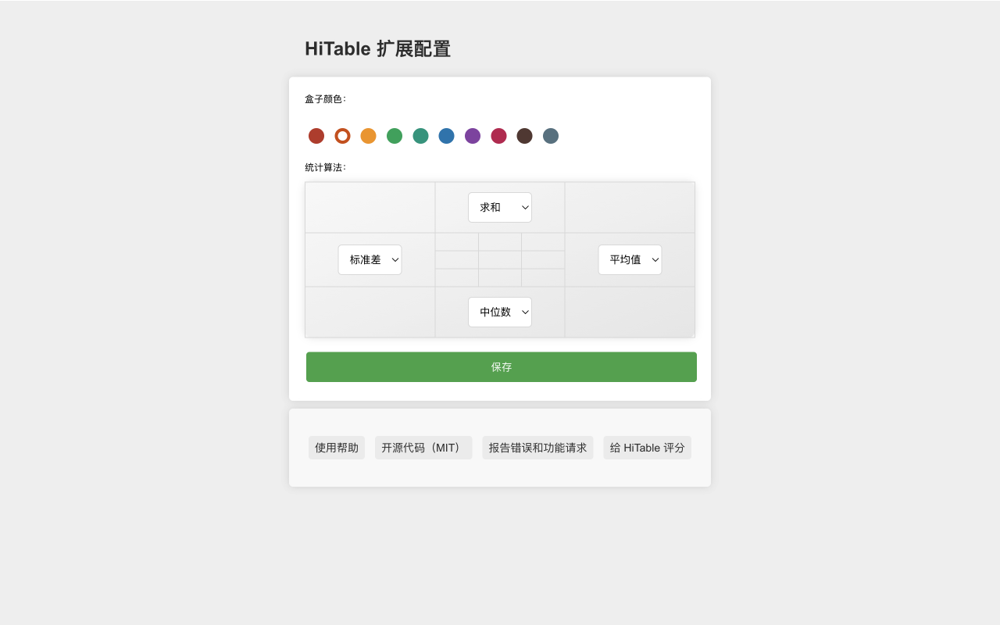

使用 HiTable 简化网页数据分析
===

> 您的随时随地的数据分析工具。

该扩展可以即时且原地计算表格行和列的统计数据。

HiTable 是一个功能强大的 Chrome 扩展，旨在简化您的数据分析任务。它允许您在浏览器中直接对 HTML 表格进行即时的、原地的计算。不再需要将表格复制粘贴到 Excel 或其他工具中进行基本计算。使用 HiTable，您可以轻松计算行和列的总和、平均值、计数和方差等。它非常适合快速数据分析、数据审计或仅仅是在网页上探索数字。

### 使用方法

首先，安装此扩展后，你需要将其固定在浏览器的工具栏上。默认情况下，此扩展是不激活的，工具栏中的图标显示为灰色。当你需要使用此扩展进行表格数据计算时，点击工具栏中的图标以激活扩展，此时图标将显示为带绿色框的图标。

一旦激活，你可以通过按下鼠标左键并拖动在表格中选择一个矩形区域。释放鼠标以结束选择，此时将在选择区域外弹出一个浮层，该浮层在四个边上分别对选择区的行和列进行各种统计。这四个边的顺时针左侧显示了各个边正在使用的统计算法。

你可以通过点击选择区域外的单元格或按下 `Esc` 键来取消选择。当按下 `Shift` 键时，在第一行或第一列拖动选择将选择多个整列或整行；如果在按下 `Shift` 键的同时点击表格的左上角单元格（即第一行的第一个单元格），将选择整个表格。

点击浮层的四个角可以在多种统计算法中切换。按下 `CTRL-C`（在 Mac 上是 `Meta-C`）可以复制选择区域，复制的内容可以粘贴到 Excel、Numbers 等工具中以进行更复杂的处理。如果快速连续按下两次 `CTRL-C`（在 Mac 上是 `Meta-C`），则可以复制包括浮层和选择区域的全部数据。

对于非数字单元格，在选择时会在其上标记删除线，并在计算时跳过该单元格。在选择区域内移动鼠标时，会高亮显示一个十字线，以便明确找到该行或列对应的统计结果。

右键点击扩展图标，可以在右键菜单中选择“选项”，这将打开配置页面。在此页面，你可以配置扩展的边框颜色、四个边的默认统计算法等。

