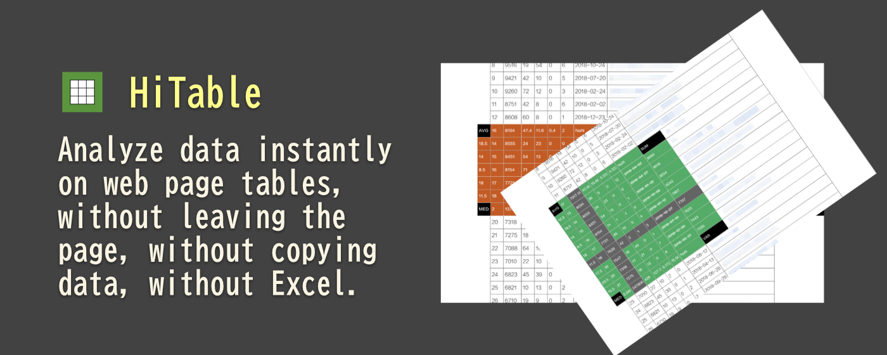
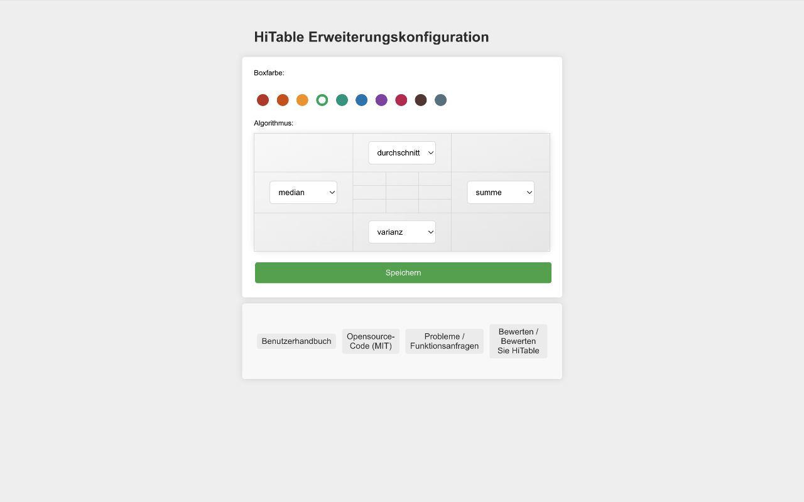

HiTable: Sofortige Analyse von Webseitentabellendaten
===

> Analysieren Sie Daten sofort in Webseitentabellen, ohne die Seite zu verlassen, ohne Daten zu kopieren, ohne Excel.

Diese Erweiterung berechnet Statistiken für Tabellenzeilen und -spalten sofort und vor Ort.

HiTable ist eine leistungsstarke Browsererweiterung, die entwickelt wurde, um Ihre Datenanalyseaufgaben zu vereinfachen. Sie ermöglicht es Ihnen, sofortige, vor Ort Berechnungen auf HTML-Tabellen direkt in Ihrem Browser durchzuführen. Kein Kopieren und Einfügen von Tabellen mehr in Excel oder andere Tools für grundlegende Berechnungen. Mit HiTable können Sie einfach Summen, Durchschnitte, Zählungen und Varianzen für Zeilen und Spalten berechnen. Es ist perfekt für schnelle Datenanalysen, Datenprüfungen oder einfach nur zum Erkunden von Zahlen auf Webseiten.

### Unterstützte Statistische Algorithmen

HiTable unterstützt 15 statistische Algorithmen, unterteilt in 4 Gruppen:

- **Grundlegende Statistik**: CNT (Anzahl), SUM (Summe), AVG (Durchschnitt), MIN (Minimum), MAX (Maximum), RNG (Spannweite)
- **Erweiterte Statistik**: MED (Median), STD (Standardabweichung), VAR (Varianz), MOD (Modus)
- **Quantil-Statistik**: Q1 (Erstes Quartil), Q3 (Drittes Quartil), IQR (Interquartilabstand)
- **Verteilungsstatistik**: SKW (Schiefe), KUR (Kurtosis)

Sie können jeden Algorithmus auf der Konfigurationsseite aktivieren oder deaktivieren.

### Wie man es benutzt

Zuerst müssen Sie nach der Installation dieser Erweiterung diese an die Symbolleiste des Browsers anheften. Standardmäßig ist diese Erweiterung nicht aktiviert und das Symbol in der Symbolleiste wird in Grau angezeigt. Wenn Sie diese Erweiterung für die Tabellendatenberechnung verwenden müssen, klicken Sie auf das Symbol in der Symbolleiste, um die Erweiterung zu aktivieren, zu diesem Zeitpunkt wird das Symbol als Symbol mit einem grünen Rahmen angezeigt.

Bitte öffnen Sie eine Seite, die eine Datentabelle enthält, wie zum Beispiel: 
https://en.wikipedia.org/wiki/Economy_of_the_United_States#Data

Sobald aktiviert, können Sie durch Drücken der linken Maustaste und Ziehen einen rechteckigen Bereich in der Tabelle auswählen. Lassen Sie die Maus los, um die Auswahl zu beenden. Dann wird außerhalb des ausgewählten Bereichs ein Overlay angezeigt, das verschiedene Statistiken für die Zeilen und Spalten des ausgewählten Bereichs an den vier Kanten anzeigt. Auf der linken Seite gegen den Uhrzeigersinn dieser vier Kanten wird der verwendete Algorithmus angezeigt.

Sie können die Auswahl abbrechen, indem Sie auf eine Zelle außerhalb des ausgewählten Bereichs klicken oder die `Esc`-Taste drücken. Wenn die `Shift`-Taste gedrückt wird, wird das Ziehen der Auswahl in der ersten Zeile oder ersten Spalte mehrere ganze Spalten oder Zeilen auswählen; wenn Sie auf die obere linke Zelle der Tabelle klicken (d.h., die erste Zelle der ersten Zeile) während Sie die `Shift`-Taste drücken, wird die gesamte Tabelle ausgewählt.

Ein Klick auf die vier Ecken der schwebenden Schicht kann zwischen mehreren statistischen Algorithmen wechseln. Das Drücken von `CTRL-C` (oder `Meta-C` auf einem Mac) kann den ausgewählten Bereich kopieren, und der kopierte Inhalt kann in Tools wie Excel, Numbers, etc. für komplexere Verarbeitung eingefügt werden. Wenn Sie `CTRL-C` (oder `Meta-C` auf einem Mac) zweimal schnell hintereinander drücken, können Sie alle Daten einschließlich der schwebenden Schicht und des ausgewählten Bereichs kopieren.

Für nicht-numerische Zellen wird während der Auswahl ein Durchstreichung auf ihnen markiert, und die Zelle wird während der Berechnung übersprungen. Wenn Sie die Maus innerhalb des ausgewählten Bereichs bewegen, wird eine Kreuzlinie hervorgehoben, um die statistischen Ergebnisse, die dieser Zeile oder Spalte entsprechen, deutlich zu finden.

Klicken Sie mit der rechten Maustaste auf das Erweiterungssymbol, und Sie können "Config" im Kontextmenü auswählen, das die Konfigurationsseite öffnet. Auf dieser Seite können Sie die Rahmenfarbe der Erweiterung, den Standardstatistikalgorithmus für die vier Seiten usw. konfigurieren.

### Fehlerberichterstattung und Feature-Vorschläge

Wenn Sie während der Nutzung auf Probleme stoßen (zum Beispiel können einige Tabellen nicht korrekt ausgewählt werden oder die Statistikschicht wird nicht korrekt angezeigt), oder wenn Sie Feature-Vorschläge haben, reichen Sie bitte ein Issue auf [GitHub](https://github.com/wxy/HiTable/issues) ein.

### Datenschutzrichtlinie

HiTable sammelt keine Benutzerdaten. Alle Daten werden auf dem Computer des Benutzers verarbeitet.

HiTable ist Open-Source-Software, die der MIT-Lizenz folgt. Sie können den Quellcode auf [GitHub](https://github.com/wxy/HiTable) einsehen.