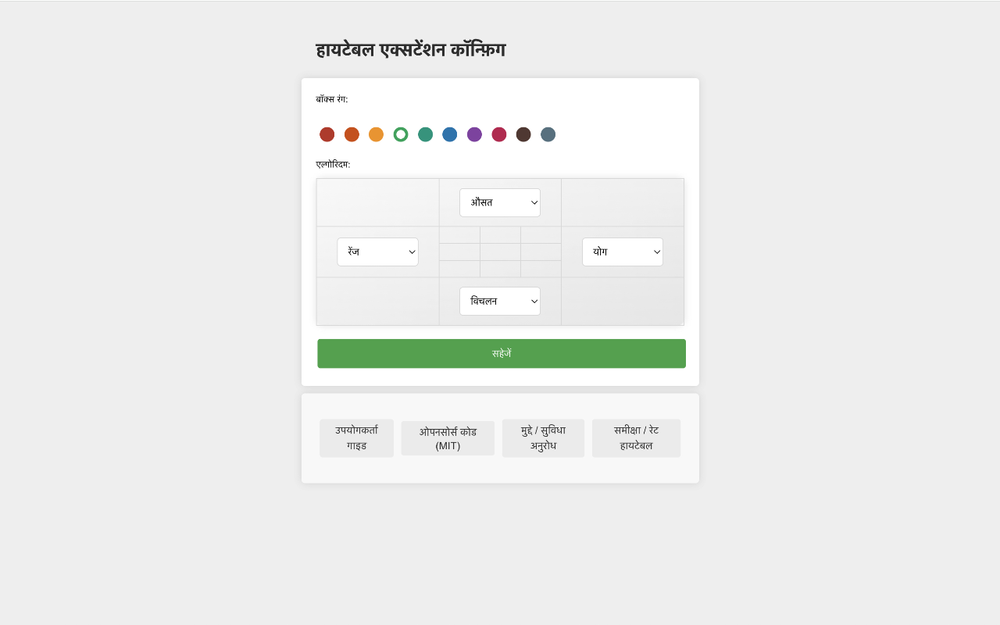

HiTable: वेब पेज सारणी डाटा का तत्काल विश्लेषण
===

> वेब पेज की सारणियों पर डाटा का तत्काल विश्लेषण, पेज को छोड़े बिना, डाटा की कॉपी बिना, एक्सेल के बिना।

यह एक्सटेंशन सारणी की पंक्तियों और स्तंभों के लिए सांख्यिकीय गणनाएं तत्काल और स्थान-ज करती है।

HiTable एक शक्तिशाली ब्राउज़र एक्सटेंशन है, जिसका डिजाईन डाटा विश्लेषण कार्यों को सरल बनाने के लिए किया गया है। यह आपको अपने ब्राउज़र में सीधे HTML सारणियों पर तत्काल, स्थान-ज गणनाएं करने की अनुमति देता है। अब आपको सारणियों को ऍक्सेल या अन्य उपकरणों में कॉपी-पेस्ट करने की आवश्यकता नहीं होगी। HiTable के साथ, आप आसानी से पंक्तियों और स्तंभों के लिए योग, औसत, गिनती, और विचलन की गणना कर सकते हैं। यह तत्काल डाटा विश्लेषण, डाटा की जांच, या वेब पेजों पर संख्याओं की खोज के लिए अद्वितीय है।

### कैसे उपयोग करें

सबसे पहले, इस एक्सटेंशन को स्थापित करने के बाद, आपको इसे ब्राउज़र के टूलबार में पिन करना होगा। डिफॉल्ट रूप से, यह एक्सटेंशन सक्रिय नहीं है, और टूलबार में आइकॉन ग्रे रंग में दिखाई देता है। सारणी डाटा गणना के लिए इस एक्सटेंशन का उपयोग करने की आवश्यकता होने पर, टूलबार में आइकॉन पर क्लिक करके एक्सटेंशन को सक्रिय करें, उस समय आइकॉन हरे ढांचे के साथ दिखाई देगा।

कृपया एक पृष्ठ खोलें जिसमें डाटा सारणी हो, जैसे कि:
https://en.wikipedia.org/wiki/Economy_of_the_United_States#Data

सक्रिय होने के बाद, आप माउस बटन दबाकर और खींचकर सारणी में एक आयताकार क्षेत्र का चयन कर सकते हैं। चयन समाप्त करने के लिए माउस को छोड़ दें, उसके बाद चयनित क्षेत्र के बाहर एक तैरता हुआ परत पॉप होगी, जो चयनित क्षेत्र के चारों तरफ़ की पंक्तियों और स्तंभों पर विभिन्न सांख्यिकीय आंकड़े उत्पन्न करेगी। इन चारों ओर घड़ी की सुई के दिशा में बाईं ओर संकेत करता है कि प्रत्येक ओर पर कौन सा सांख्यिकीय एल्गोरिदम उपयोग में है।

आप चयन रद्द कर सकते हैं, चयनित क्षेत्र के बाहर एक सेल पर क्लिक करके या `Esc` कुंजी दबाकर। `Shift` कुंजी दबाने पर, पहली पंक्ति या पहले स्तambh में चयन को खींचने से कई पूरे स्तambh या पंक्तियां चुने जाएंगे; यदि आप `Shift` कुंजी दबाते हुए सारणी के ऊपरी बाएँ सेल (अर्थात्, पहली पंक्ति का पहला सेल) पर क्लिक करते हैं, तो पूरी सारणी चुनी जाएगी।

तैरती परत के चारों कोनों पर क्लिक करने से कई सांख्यिकीय एल्गोरिद्मों के बीच स्विच किया जा सकता है। `CTRL-C` (या Mac पर `Meta-C`) दबाने से चयनित क्षेत्र की प्रतिलिपि बनाई जा सकती है, और प्रतिलिपि की गई सामग्री को ऍक्सेल, नंबर्स आदि जैसे उपकरणों में पेस्ट करके और अधिक जटिल प्रक्रिया कर सकते हैं। अगर आप तेजी से `CTRL-C` (या Mac पर `Meta-C`) दो बार दबते हैं, तो आप तैरती परत और चयनित क्षेत्र सहित सभी डाटा की प्रतिलिपि बना सकते हैं।

संख्यात्मक सेलों के लिए, चयन के दौरान इनको रेखांकित किया जाएगा, और गणना के दौरान सेल को छोड़ दिया जाएगा। चयनित क्षेत्र के भीतर माउस को हिलाने पर एक क्रॉस लाइन को हाइलाइट किया जाएगा, ताकि उस पंक्ति या स्तंभ के अनुरूप सांख्यिकीय परिणामों को स्पष्ट रूप से खोजा जा सके।

एक्सटेंशन आइकॉन पर दाएं क्लिक करें, और आप दाएं क्लिक मेन्यू में "Config" का चयन कर सकते हैं, जो कॉन्फ़िगरेशन पेज खोलेगा। इस पेज पर, आप एक्सटेंशन के बॉर्डर का रंग, चारों ओर के लिए डिफॉल्ट सांख्यिकीय एल्गोरिदम आदि कॉन्फ़िगर कर सकते हैं।

### त्रुटि रिपोर्टिंग और सुविधा सुझाव

यदि आपको इसका उपयोग करते समय कोई समस्या का सामना करना पड़े (उदाहरण के लिए, कुछ सारणियाँ सही रूप से चयनित नहीं की जा सकती हैं या सांख्यिकीय परत सही ढंग से प्रदर्शित नहीं होती है), या आपके पास कोई सुविधा सुझाव हो, तो कृपया [GitHub](https://github.com/wxy/HiTable/issues) पर एक मुद्दा जमा करें।

### गोपनीयता नीति

HiTable किसी भी उपयोगकर्ता डाटा को एकत्र नहीं करता है। सभी डाटा उपयोगकर्ता के कंप्यूटर पर संसाधित होता है।

HiTable मुक्त स्रोत सॉफ़्टवेयर है, जिसे MIT लाइसेंस के अनुसार बनाया गया है। आप [GitHub](https://github.com/wxy/HiTable) पर स्रोत कोड देख सकते हैं।