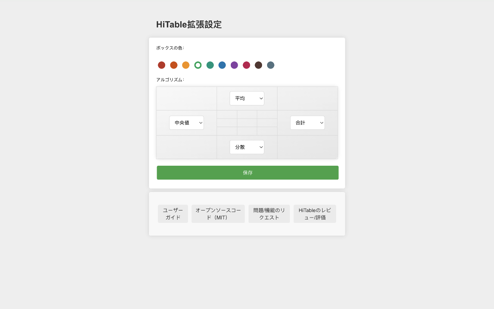

HiTable：ウェブページのテーブルデータの即時解析
===

> ページを離れず、データをコピーせず、Excelを使わずに、ウェブページのテーブルデータを即時に解析します。

この拡張機能は、テーブルの行と列の統計を即時に、その場で計算します。

HiTableは、データ分析タスクを簡単にするために設計された強力なブラウザ拡張機能です。HTMLテーブル上で直接、ブラウザ内で即時、その場での計算を行うことができます。もうExcelや他のツールにテーブルをコピー＆ペーストして基本的な計算をする必要はありません。HiTableを使用すると、行と列の合計、平均、カウント、分散を簡単に計算することができます。これは、クイックデータ分析、データ監査、またはウェブページ上の数字の探索に最適です。

### サポートされる統計アルゴリズム

HiTableは15種類の統計アルゴリズムをサポートし、4つのグループに分かれています：

- **基本統計**：CNT（カウント）、SUM（合計）、AVG（平均）、MIN（最小値）、MAX（最大値）、RNG（範囲）
- **高度な統計**：MED（中央値）、STD（標準偏差）、VAR（分散）、MOD（最頻値）
- **分位数統計**：Q1（第1四分位数）、Q3（第3四分位数）、IQR（四分位範囲）
- **分布統計**：SKW（歪度）、KUR（尖度）

設定ページで任意のアルゴリズムを有効または無効にできます。

### 使い方

まず、この拡張機能をインストールした後、ブラウザのツールバーにピン留めする必要があります。デフォルトでは、この拡張機能は有効化されておらず、ツールバーのアイコンはグレーで表示されます。テーブルデータの計算にこの拡張機能を使用する必要がある場合は、ツールバーのアイコンをクリックして拡張機能を有効化します。その時点で、アイコンは緑色のフレーム付きのアイコンとして表示されます。

データテーブルを含むページを開いてください。例えば：
https://en.wikipedia.org/wiki/Economy_of_the_United_States#Data

一旦アクティブ化されると、左クリックを押しながらドラッグすることで、表の中に矩形領域を選択できます。マウスを離して選択を終了すると、選択領域の外側にオーバーレイが表示され、選択領域の行と列に対するさまざまな統計が四つの辺に表示されます。これらの四つの辺の反時計回りの左側には、各辺で使用されている統計アルゴリズムが表示されます。

選択領域外のセルをクリックするか、`Esc`キーを押すことで選択をキャンセルすることができます。`Shift`キーが押されていると、最初の行または最初の列で選択をドラッグすると、複数の全列または全行が選択されます。`Shift`キーを押しながらテーブルの左上のセル（つまり、最初の行の最初のセル）をクリックすると、テーブル全体が選択されます。

浮かび上がるレイヤーの四隅をクリックすると、複数の統計アルゴリズムを切り替えることができます。`CTRL-C`（またはMacでは`Meta-C`）を押すと、選択領域をコピーすることができ、コピーした内容はExcel、Numbersなどのツールに貼り付けてより複雑な処理を行うことができます。`CTRL-C`（またはMacでは`Meta-C`）を素早く2回連続で押すと、浮かび上がるレイヤーや選択領域を含むすべてのデータをコピーすることができます。

非数値のセルには、選択中に取り消し線が引かれ、計算中にセルがスキップされます。選択領域内でマウスを動かすと、クロスラインがハイライト表示され、その行または列に対応する統計結果を明確に見つけることができます。

拡張機能のアイコンを右クリックすると、右クリックメニューで「Config」を選択することができ、設定ページが開きます。このページでは、拡張機能の枠線の色、四方のデフォルトの統計アルゴリズムなどを設定することができます。

### エラー報告と機能提案

使用中に問題が発生した場合（例えば、一部のテーブルが正しく選択できない、または統計レイヤーが正しく表示されないなど）、または機能提案がある場合は、[GitHub](https://github.com/wxy/HiTable/issues)にIssueを提出してください。

### プライバシーポリシー

HiTableはユーザーデータを収集しません。すべてのデータはユーザーのコンピュータ上で処理されます。

HiTableはMITライセンスに従うオープンソースソフトウェアです。ソースコードは[GitHub](https://github.com/wxy/HiTable)で閲覧することができます。