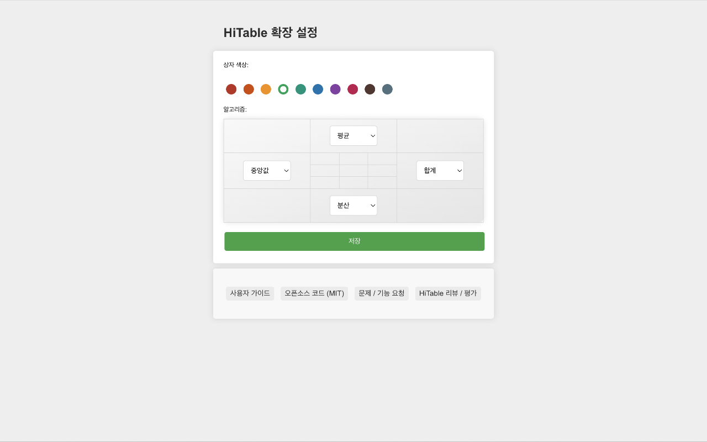

HiTable: 웹 페이지 테이블 데이터 즉시 분석
===

> 웹 페이지 테이블에서 데이터를 즉시 분석하십시오. 페이지를 떠나지 않고, 데이터를 복사하지 않고, Excel 없이.

이 확장 프로그램은 테이블 행과 열에 대한 통계를 즉시 및 현장에서 계산합니다.

HiTable은 데이터 분석 작업을 단순화하도록 설계된 강력한 브라우저 확장 프로그램입니다. HTML 테이블에서 브라우저 내에서 즉시, 현장에서 계산을 수행할 수 있습니다. Excel이나 기타 도구에 테이블을 복사하고 붙여넣는 것은 더 이상 필요하지 않습니다. HiTable을 사용하면 행과 열에 대한 합계, 평균, 카운트, 분산을 쉽게 계산할 수 있습니다. 빠른 데이터 분석, 데이터 감사 또는 웹 페이지에서 숫자 탐색에 이상적입니다.

### 사용 방법

먼저, 이 확장 프로그램을 설치한 후 브라우저의 도구 모음에 고정해야 합니다. 기본적으로 이 확장 프로그램은 활성화되지 않으며, 도구 모음의 아이콘은 회색으로 표시됩니다. 테이블 데이터 계산에 이 확장 프로그램을 사용해야 할 때 도구 모음의 아이콘을 클릭하여 확장 프로그램을 활성화하십시오. 이 시점에서 아이콘은 녹색 프레임이 있는 아이콘으로 표시됩니다.

데이터 테이블이 포함된 페이지를 열어 주십시오. 예를 들어: 
https://en.wikipedia.org/wiki/Economy_of_the_United_States#Data

활성화되면 마우스 왼쪽 버튼을 누르고 드래그하여 표에서 직사각형 영역을 선택할 수 있습니다. 선택을 종료하려면 마우스를 놓으십시오. 그러면 선택한 영역 외부에 오버레이가 나타나고, 선택한 영역의 행과 열에 대한 다양한 통계가 네 개의 가장자리에 표시됩니다. 이 네 개의 가장자리의 반시계 방향 왼쪽에는 각 가장자리가 사용하고 있는 통계 알고리즘이 표시됩니다.

선택한 영역 외부의 셀을 클릭하거나 `Esc` 키를 눌러 선택을 취소할 수 있습니다. `Shift` 키를 누르면 첫 번째 행이나 첫 번째 열에서 선택을 드래그하면 여러 개의 전체 열이나 행이 선택됩니다. `Shift` 키를 누른 상태에서 테이블의 왼쪽 상단 셀(즉, 첫 번째 행의 첫 번째 셀)을 클릭하면 전체 테이블이 선택됩니다.

부동 레이어의 네 모서리를 클릭하면 여러 통계 알고리즘을 전환할 수 있습니다. `CTRL-C` (또는 Mac에서 `Meta-C`)를 누르면 선택한 영역을 복사할 수 있으며, 복사한 내용은 Excel, Numbers 등의 도구에 붙여넣어 더 복잡한 처리를 수행할 수 있습니다. `CTRL-C` (또는 Mac에서 `Meta-C`)를 빠르게 두 번 누르면 부동 레이어와 선택한 영역을 포함한 모든 데이터를 복사할 수 있습니다.

숫자가 아닌 셀은 선택 중에 취소선이 그어지며, 계산 중에 셀이 건너뛰어집니다. 선택한 영역 내에서 마우스를 움직이면 십자선이 강조되어 해당 행이나 열에 해당하는 통계 결과를 명확하게 찾을 수 있습니다.

확장 아이콘을 마우스 오른쪽 버튼으로 클릭하면 오른쪽 클릭 메뉴에서 "Config"를 선택할 수 있습니다. 이 페이지에서 확장 프로그램의 테두리 색상, 네 변의 기본 통계 알고리즘 등을 설정할 수 있습니다.

### 오류 보고 및 기능 제안

사용 중 문제가 발생한 경우(예: 일부 테이블을 올바르게 선택할 수 없거나 통계 레이어가 올바르게 표시되지 않는 경우) 또는 기능 제안이 있는 경우 [GitHub](https://github.com/wxy/HiTable/issues)에서 이슈를 제출해 주십시오.

### 개인정보 보호 정책

HiTable은 사용자 데이터를 수집하지 않습니다. 모든 데이터는 사용자의 컴퓨터에서 처리됩니다.

HiTable은 MIT 라이선스를 따르는 오픈 소스 소프트웨어입니다. [GitHub](https://github.com/wxy/HiTable)에서 소스 코드를 볼 수 있습니다.