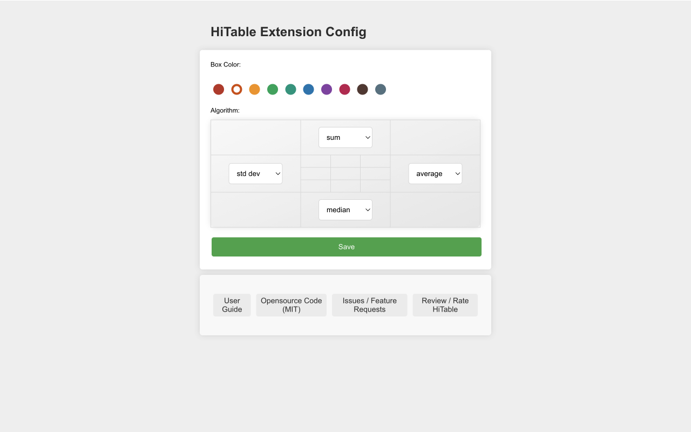

HiTable: Мгновенный анализ данных веб-страницы таблицы
===

> Мгновенный анализ данных в таблицах веб-страниц, без выхода из страницы, без копирования данных, без Excel.

Данное расширение мгновенно и на месте рассчитывает статистику для строк и столбцов таблицы.

HiTable - это мощное расширение для браузера, созданное для упрощения ваших задач по анализу данных. Оно позволяет выполнять мгновенные расчеты прямо в HTML-таблицах вашего браузера. Больше нет необходимости копировать и вставлять таблицы в Excel или другие инструменты для основных вычислений. С HiTable вы можете легко рассчитывать суммы, средние значения, количество и дисперсии для строк и столбцов. Это идеально подходит для быстрого анализа данных, проверки данных или просто изучения чисел на веб-страницах.

### Как использовать

Сначала, после установки этого расширения, вам нужно закрепить его на панели инструментов браузера. По умолчанию это расширение не активировано, и иконка на панели инструментов отображается серой. Когда вам нужно использовать это расширение для расчета данных таблицы, нажмите на иконку на панели инструментов, чтобы активировать расширение, после чего иконка будет отображаться как иконка с зеленой рамкой.

Откройте страницу, которая содержит таблицу данных, например:
https://en.wikipedia.org/wiki/Economy_of_the_United_States#Data

После активации вы можете выбрать прямоугольную область в таблице, нажав левую кнопку мыши и перетаскивая. Отпустите кнопку мыши для завершения выбора, после чего всплывет плавающий слой за пределами выбранной области, который будет выполнять различные статистические данные по строкам и столбцам выбранной области со всех сторон. По часовой стрелке слева от этих четырех сторон показывает статистический алгоритм, используемый по каждой стороне.

Вы можете отменить выбор, нажав на ячейку за пределами выбранной области или нажав клавишу `Esc`. Когда нажата клавиша `Shift`, перетаскивание выбора в первой строке или первом столбце выберет несколько целых столбцов или строк; если вы нажмете на верхнюю левую ячейку таблицы (то есть первую ячейку первой строки) при нажатой клавише `Shift`, будет выбрана вся таблица.

Нажатие на четыре угла плавающего слоя может переключать между несколькими статистическими алгоритмами. Нажатие `CTRL-C` (или `Meta-C` на Mac) может скопировать выбранную область, а скопированное содержимое можно вставить в такие инструменты, как Excel, Numbers и т. д. для более сложной обработки. Если вы нажмете `CTRL-C` (или `Meta-C` на Mac) дважды подряд, вы сможете скопировать все данные, включая плавающий слой и выбранную область.

Для клеток, не содержащих числовые значения, при выборе на них будет помечен зачеркнутым, и клетка будет пропущена при расчете. При движении мыши внутри выбранной области будет выделена крестообразная линия, чтобы ясно найти статистические результаты, соответствующие этой строке или столбцу.

Щелкните правой кнопкой мыши на иконке расширения, и вы можете выбрать "Config" в контекстном меню, которое откроет страницу настроек. На этой странице вы можете настроить цвет рамки расширения, стандартный статистический алгоритм для четырех сторон и т. д.

### Отчет об ошибках и предложения по функциональности

Если вы столкнулись с какими-либо проблемами во время использования (например, некоторые таблицы не могут быть правильно выбраны или слой статистики отображается некорректно) или у вас есть предложения по функциональности, пожалуйста, отправьте вопрос на [GitHub](https://github.com/wxy/HiTable/issues).

### Политика конфиденциальности

HiTable не собирает никаких пользовательских данных. Все данные обрабатываются на компьютере пользователя.

HiTable - это программное обеспечение с открытым исходным кодом, следующее по лицензии MIT. Вы можете просмотреть исходный код на [GitHub](https://github.com/wxy/HiTable).