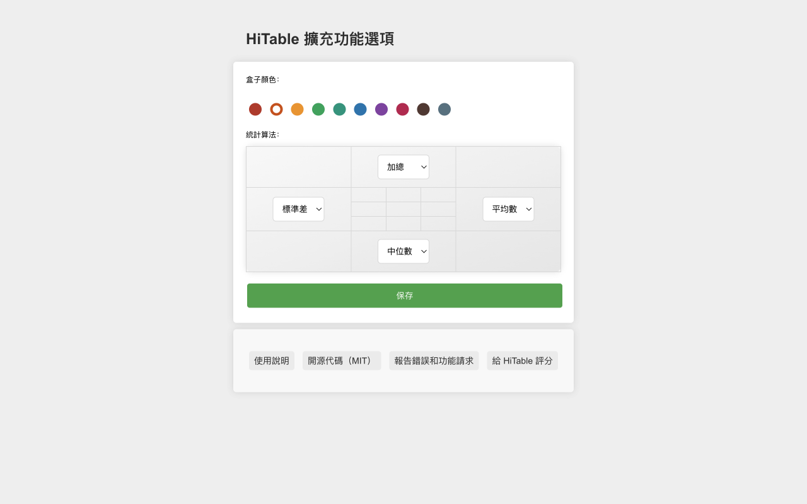

HiTable：直接分析網頁表格數據
===

> 無須離開網頁、無須複製數據、無須開啟 Excel，即可在網頁的表格上進行各種統計分析。

該擴充功能可以即時且原地計算表格行和列的統計數據。

HiTable 是一個功能強大的瀏覽器擴充功能，旨在簡化您的數據分析任務。它允許您在瀏覽器中直接對 HTML 表格進行即時的、原地的計算。不再需要將表格複製貼上到 Excel 或其他工具中進行基本計算。使用 HiTable，您可以輕鬆計算行和列的總和、平均值、計數和方差等。它非常適合快速數據分析、數據審計或僅僅是在網頁上探索數字。

### 使用方法

首先，安裝此擴充功能後，你需要將其固定在瀏覽器的工具列上。預設情況下，此擴充功能是未啟動的，工具列中的圖示顯示為灰色。當你需要使用此擴充功能進行表格數據計算時，點擊工具列中的圖示以啟動擴充功能，此時圖示將顯示為帶綠色框的圖示。

請打開一個包含數據表的頁面，例如：
https://en.wikipedia.org/wiki/Economy_of_the_United_States#Data

一旦啟動，你可以透過按下滑鼠左鍵並拖曳在表格中選擇一個矩形區域。釋放滑鼠以結束選擇，此時將在選擇區域外彈出一個浮層，該浮層在四個邊上分別對選擇區的行和列進行各種統計。這四個邊的逆時針左側顯示了各個邊正在使用的統計算法。

你可以透過點擊選擇區域外的單元格或按下 `Esc` 鍵來取消選擇。當按下 `Shift` 鍵時，在第一行或第一列拖曳選擇將選擇多個整列或整行；如果在按下 `Shift` 鍵的同時點擊表格的左上角單元格（即第一行的第一個單元格），將選擇整個表格。

點擊浮層的四個角可以在多種統計算法中切換。按下 `CTRL-C`（在 Mac 上是 `Meta-C`）可以複製選擇區域，複製的內容可以貼上到 Excel、Numbers 等工具中以進行更複雜的處理。如果快速連續按下兩次 `CTRL-C`（在 Mac 上是 `Meta-C`），則可以複製包括浮層和選擇區域的全部數據。

對於非數字單元格，在選擇時會在其上標記刪除線，並在計算時跳過該單元格。在選擇區域內移動滑鼠時，會高亮顯示一個十字線，以便明確找到該行或列對應的統計結果。

右鍵點擊擴充功能圖示，可以在右鍵選單中選擇“配置”，這將打開配置頁面。在此頁面，你可以配置擴充功能的邊框顏色、四個邊的預設統計算法等。

### 錯誤報告和功能建議

如果你在使用過程中遇到任何問題（例如，有的表格不能正確選擇或顯示統計層），或者有任何功能建議，請在 [GitHub](https://github.com/wxy/HiTable/issues) 上提交議題。

### 隱私政策

HiTable 不會收集任何使用者資料。所有資料都是在使用者的電腦上進行處理的。

HiTable 是開源軟體，遵循 MIT 授權。你可以在 [GitHub](https://github.com/wxy/HiTable) 上查看原始碼。